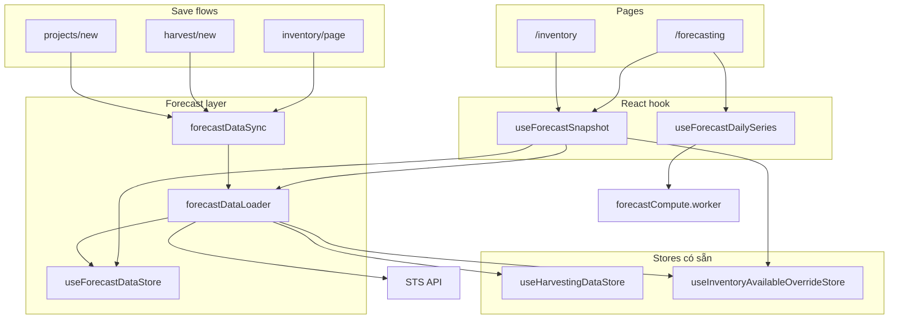

# Triển khai tối ưu Forecasting & Inventory (STS Renew)

> **Stack:** Next.js 16 · React 19 · Zustand  
> **Trang:** `/forecasting`, `/inventory`  
> **Trạng thái:** Đã triển khai (Phase 1–3)  
> **Parity:** Cùng kiến trúc với Flutter app (`ForecastDataCache` / `ForecastDataLoader` / `ForecastDataSync` trong stsapp)

---

## Mục tiêu

Giảm thời gian load và cảm giác “đơ” khi mở Forecasting / Inventory bằng cách:

1. **Share cache** harvest / zones / rules giữa 2 màn — không fetch trùng.
2. **Invalidate có scope** sau save (override, harvest, project).
3. **Tối ưu CPU:** single-pass daily series, precompute caps, Web Worker.
4. **UX:** stale-while-revalidate, debounce filter, defer breakdown chart.

---

## Tổng quan kiến trúc



### Nguyên tắc phân tách dữ liệu

| Loại | Store | Ghi chú |
|------|-------|---------|
| Catalog (farms, grasses, farmZones, projects) | `useHarvestingDataStore` | **Không** copy vào forecast cache |
| Raw nặng (harvest, zones, rules) | `useForecastDataStore` | TTL 5 phút, invalidate theo scope |
| Override CRUD | `useInventoryAvailableOverrideStore` | Loader fetch; sync invalidate sau save |
| Chart / daily series | Derived in-memory | Worker recompute; không persist |

---

## Module đã triển khai

### 1. `useForecastDataStore`

**Path:** `src/shared/store/forecastDataStore.ts`

Zustand store — bộ nhớ cache session cho dữ liệu forecast nặng.

**Scopes:**

```typescript
type ForecastCacheScope =
  | "overrides"
  | "harvest"
  | "zones"
  | "rules"
  | "reference"  // chỉ signal refresh catalog, không lưu catalog
  | "all";
```

**State quan trọng:**

| Field | Ý nghĩa |
|-------|---------|
| `harvestRowsRaw` | JSON rows từ API harvesting index |
| `forecastRows` | Sau `rowsToMockHarvestRows` |
| `zoneConfigs` | Zone configuration rows |
| `regrowthConfig` | Regrowth rules đã resolve |
| `generation` | Tăng mỗi `invalidate()` |
| `hasSnapshot` | Đủ data để render chart |
| `isLoading` | Lần đầu, chưa có snapshot |
| `isRefreshing` | Có snapshot, đang fetch nền |
| `isRecomputing` | Worker đang chạy daily series |
| `fetchedAt` | Timestamp per scope (TTL 5 phút) |
| `invalidated` | Scopes cần fetch lại |

**API chính:**

- `invalidate(scope)` — xóa data scope, tăng `generation`
- `markValid(scope)` — đánh dấu fresh, cập nhật `fetchedAt`
- `scopesNeedingFetch(scopes, force?)` — scopes cần gọi API
- `setHarvestData` / `setZoneConfigs` / `setRegrowthConfig` — ghi cache sau load

---

### 2. `forecastDataLoader`

**Path:** `src/features/forecasting/forecastDataLoader.ts`

**Entry points:**

```typescript
ensureForecastDataLoaded({ scopes?, force?, showLoading? })
reloadForecastFromCache(scopes, showLoading?)
prefetchForecastDataIfIdle()
```

**Load theo scope (song song qua `Promise.all`):**

| Scope | Hành động |
|-------|-----------|
| `reference` | `fetchAllHarvestingReferenceData(true)` — **luôn force** |
| `zones` | `fetchZoneConfigurations()` |
| `harvest` | `fetchHarvestRowsForForecasting` + `rowsToMockHarvestRows` |
| `rules` | `fetchRegrowthRules()` → `resolveRegrowthReferenceConfigFromRules` |
| `overrides` | `useInventoryAvailableOverrideStore.fetchOverrides()` |

**Harvest window thống nhất** (cả forecasting lẫn inventory):

- From: **today − 24 tháng**
- To: **today + 30 tháng**
- Params: `perPage: 500`, `maxPages: 400`

Định nghĩa tại `src/features/forecasting/forecastDateUtils.ts` → `forecastHarvestDateRange()`.

**Cơ chế an toàn:**

- `loadToken` — response cũ bị bỏ nếu có request mới.
- `remapForecastRowsIfNeeded()` — sau khi zones + harvest xong, remap nếu zone config có sau harvest.

**Loading UX:**

- Chưa có snapshot → `isLoading: true`
- Đã có snapshot → `isRefreshing: true` (không block UI)

---

### 3. `forecastDataSync`

**Path:** `src/features/forecasting/forecastDataSync.ts`

Đồng bộ cache sau mutation. Debounce **150ms** để gom nhiều save liên tiếp.

```typescript
onForecastMutation("harvest")
onForecastMutations(["reference", "harvest"])
rowDataAffectsHarvest(row)  // dùng cho project save
notifyForecastRefresh(scopes)
ensureForecastReady()
```

**Luồng:**

```
onForecastMutation(scope)
  → pendingScopes.add(scope)
  → debounce 150ms
  → invalidate(scope) cho từng scope
  → ensureForecastDataLoaded({ scopes, force: true, showLoading: false })
```

---

### 4. `useForecastSnapshot`

**Path:** `src/features/forecasting/useForecastSnapshot.ts`

Hook **bắt buộc** cho màn cần forecast data. Thay thế pattern cũ: local `useState` + nhiều `useEffect` fetch.

```typescript
const {
  forecastRows,       // ForecastHarvestRow[]
  zoneConfigs,        // ZoneConfigurationRow[]
  regrowthConfig,     // fallback DEFAULT nếu null
  overridesByZone,    // từ inventoryAvailableOverrideStore
  isLoading,
  isRefreshing,
  isRecomputing,
  hasSnapshot,
  error,
  reloadFromCache,
} = useForecastSnapshot({ enabled?: boolean });
```

Mount → `ensureForecastDataLoaded(all scopes)`.

**Consumers hiện tại:**

- `src/features/forecasting/inventoryForecastView.tsx`
- `src/app/inventory/page.tsx`

---

### 5. Compute pipeline (Phase 2)

#### 5a. Parallel harvest pagination

**Path:** `src/features/forecasting/mapHarvestApiToForecastRows.ts`

- Fetch page 1 → biết còn trang hay không.
- Pages 2..N: batch **concurrency 3** (`fetchHarvestPagesParallel`).

#### 5b. Single-pass daily series

**Path:** `src/features/forecasting/forecastAvailableAtDate.ts`

```typescript
computeInventoryStyleFarmGrassDailySeriesWithBreakdown(...)
// → { aggregate: RollingDailyAvailableDay[], byFarmProduct: Map<...> }
```

Thay loop N+1 (1 lần tổng + N lần per farm|grass) bằng **một pass**, đồng thời build breakdown.

Precompute trong pass:

- `rowsWithCapsByYmd` — cache `applyLatestZoneMaxKgToForecastRows` theo ngày
- `maxByZoneCache`, `regrowthByZoneCache`, `harvestByZoneCache`

Wrapper cũ vẫn hoạt động:

```typescript
computeInventoryStyleFarmGrassDailySeries(...) // → .aggregate
```

#### 5c. Web Worker + debounce

| File | Vai trò |
|------|---------|
| `useDebouncedValue.ts` | Debounce farm/grass filter **300ms** |
| `useForecastCompute.ts` | Hook `useForecastDailySeries` — orchestrate worker |
| `forecastCompute.worker.ts` | Chạy compute off main thread |
| `forecastComputeShared.ts` | Logic dùng chung worker + sync fallback |

Worker nhận filtered rows + configs → trả `aggregate` + `byFarmProduct` (serialized).

Fallback: `typeof Worker === "undefined"` (SSR) hoặc worker lỗi → chạy sync trên main thread.

---

### 6. UX (Phase 3)

**`inventoryForecastView.tsx`:**

| State | UI |
|-------|-----|
| `!hasSnapshot && isLoading` | Skeleton / banner loading |
| `hasSnapshot && isRefreshing` | Giữ chart cũ + badge refreshing |
| `isRecomputing` | Overlay mỏng trên aggregate chart |
| Breakdown chart | Deferred qua `requestIdleCallback` + `startTransition` |

**`DashboardLayout.tsx`:**

- Sau **2 giây** idle (user đã login) → `prefetchForecastDataIfIdle()` warm cache.

---

## Mutation hooks (đã gắn)

| Sự kiện | File | Gọi | Scope |
|---------|------|-----|-------|
| Save balance override | `src/app/inventory/page.tsx` | `onForecastMutation("overrides")` | overrides |
| Remove override | `src/app/inventory/page.tsx` | `onForecastMutation("overrides")` | overrides |
| Harvest save OK | `src/app/harvest/new/page.tsx` | `onForecastMutation("harvest")` | harvest |
| Project save OK | `src/app/projects/new/page.tsx` | `onForecastMutations([...])` | reference + harvest? |

**Project save — logic harvest:**

```typescript
const mutationScopes = ["reference"];
if (rowData && rowDataAffectsHarvest(rowData)) {
  mutationScopes.push("harvest");
}
onForecastMutations(mutationScopes);
```

**Lưu ý:** Chart cập nhật ngay nếu user **đang mở** `/forecasting` hoặc `/inventory` (Zustand subscribe). Chưa mở → cache vẫn invalid; lần mở sau load data mới.

---

## Luồng end-to-end

### Mở `/forecasting` lần đầu

```
useForecastSnapshot mount
  → ensureForecastDataLoaded(all scopes)
  → parallel: reference, zones, harvest, rules, overrides
  → rowsToMockHarvestRows → forecastDataStore
  → hasSnapshot = true
  → useForecastDailySeries (worker) → chart data
  → render aggregate chart → idle → breakdown chart
```

### Mở `/inventory` sau `/forecasting` (TTL còn hiệu lực)

```
useForecastSnapshot mount
  → scopesNeedingFetch() = ∅
  → skip API harvest/zones/rules
  → render từ cache (< 1s)
```

### Save override tại `/inventory`

```
upsertOverrides() → API OK
  → onForecastMutation("overrides")
  → fetch overrides → store cập nhật
  → nếu /forecasting đang mở → chart recompute (worker)
```

---

## Danh sách file

### Tạo mới

```
src/shared/store/forecastDataStore.ts
src/features/forecasting/forecastDataLoader.ts
src/features/forecasting/forecastDataSync.ts
src/features/forecasting/useForecastSnapshot.ts
src/features/forecasting/forecastDateUtils.ts
src/features/forecasting/useDebouncedValue.ts
src/features/forecasting/useForecastCompute.ts
src/features/forecasting/forecastCompute.worker.ts
src/features/forecasting/forecastComputeShared.ts
```

### Sửa

```
src/features/forecasting/inventoryForecastView.tsx   — snapshot, worker, SWR UX
src/app/inventory/page.tsx                          — snapshot, mutation hooks
src/features/forecasting/mapHarvestApiToForecastRows.ts — parallel pagination
src/features/forecasting/forecastAvailableAtDate.ts   — WithBreakdown
src/app/harvest/new/page.tsx                        — onForecastMutation
src/app/projects/new/page.tsx                         — onForecastMutations
src/widgets/layout/DashboardLayout.tsx                — prefetch idle
```

### Không đổi cấu trúc

```
src/shared/store/harvestingDataStore.ts
src/shared/store/inventoryAvailableOverrideStore.ts
```

---

## Phase triển khai

| Phase | Hạng mục | Trạng thái |
|-------|----------|------------|
| **1** | Store + loader + sync + refactor 2 màn + mutation hooks | Done |
| **2a** | Parallel pagination + WithBreakdown + precompute caps | Done |
| **2b** | Web Worker + debounce filter 300ms | Done |
| **3** | Stale-while-revalidate + deferred breakdown + Dashboard prefetch | Done |

---

## So sánh trước / sau (tóm tắt)

| Vấn đề cũ | Cách xử lý mới |
|-----------|----------------|
| 2 màn fetch harvest riêng, range khác nhau | `useForecastDataStore` + window −24..+30 tháng |
| Pagination tuần tự | Parallel 3 pages/batch |
| `computeDailySeries` × (1+N) | `WithBreakdown` single-pass |
| Caps recompute mỗi ngày | Cache `rowsWithCapsByYmd` |
| Save không sync forecast | `forecastDataSync` hooks |
| Filter gây recompute liên tục | Debounce 300ms |
| Loader che chart / chart render khi chưa có data | `hasSnapshot` gate |
| Catalog stale sau project save | `reference` scope luôn `force: true` |

---

## Kiểm tra (smoke test)

1. **First load:** `/forecasting` — chart xuất hiện sau snapshot; không flash data rỗng.
2. **Shared cache:** `/forecasting` → `/inventory` — Network tab không refetch harvest (trong 5 phút).
3. **Override sync:** Save balance `/inventory` → chart `/forecasting` cập nhật (cùng session).
4. **Harvest sync:** Save harvest → upcoming list / forecast có plan mới.
5. **Project sync:** Save project có farm/zone/qty → forecast refresh.
6. **Filter:** Đổi farm/grass nhanh — UI không freeze.
7. **Regression:** So sánh available kg 3 ngày với Flutter stsapp (cùng dataset).

**Typecheck:**

```bash
cd /Users/nguyenthi/NguyenThi/phpzone/src/stsrenew
npx tsc --noEmit
```

---

## Hướng dẫn mở rộng

### Thêm màn dùng forecast data

```typescript
import { useForecastSnapshot } from "@/features/forecasting/useForecastSnapshot";

function MyScreen() {
  const { forecastRows, zoneConfigs, hasSnapshot, isLoading } = useForecastSnapshot();
  // Không gọi fetchHarvestRowsForForecasting trực tiếp
}
```

### Thêm mutation hook

Sau API save thành công:

```typescript
import { onForecastMutation } from "@/features/forecasting/forecastDataSync";

await saveSomething();
onForecastMutation("harvest"); // hoặc "zones", "overrides", "rules", "reference"
```

### Thêm scope cache mới

1. Thêm literal vào `ForecastCacheScope` trong `forecastDataStore.ts`.
2. Thêm branch load trong `forecastDataLoader.ts`.
3. Gọi `invalidate(scope)` tại mutation point tương ứng.

### Worker (Next.js)

- Worker file chỉ import qua `forecastComputeShared.ts` (pure TS).
- Không import React hoặc module phụ thuộc DOM trong worker.
- SSR: fallback sync tự động trong `useForecastCompute`.

---

## Tài liệu liên quan

- [FORECASTING_CALCULATIONS.md](../src/features/forecasting/FORECASTING_CALCULATIONS.md)
- [INVENTORY_AVAILABLE_CAP_RULES.md](../src/features/forecasting/INVENTORY_AVAILABLE_CAP_RULES.md)
- Flutter (stsapp): `.cursor/plans/forecast_cache_optimize_f908c6e7.plan.md`
