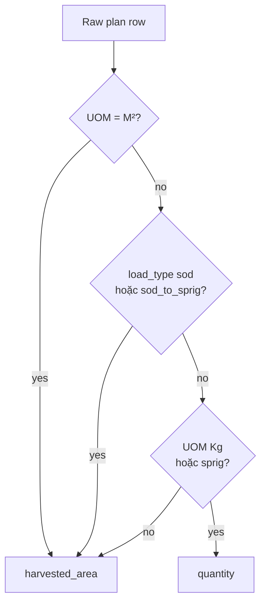
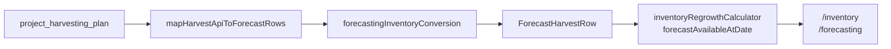

# Harvested area vs quantity — Inventory & Forecasting

Tài liệu quy định **cột DB nào** được dùng khi tính toán pipeline dùng chung cho **`/inventory`** và **`/forecasting`**. Hai trang UI không có công thức riêng — cùng đọc `ForecastHarvestRow[]` qua `useForecastSnapshot`.

---

## Quy tắc bắt buộc

### Dùng `harvested_area` (m²)

Áp dụng khi **một trong các điều kiện** sau đúng:

| # | Điều kiện | Ví dụ `load_type` / UOM |
|---|-----------|-------------------------|
| 1 | UOM = **M²** | `M2`, `m²`, `sqm` |
| 2 | Load type = **Sod** | `sod` |
| 3 | Load type = **Sod → Sprig** | `sod_to_sprig`, `sod_for_sprig` |

→ **Không đọc** cột `quantity` plan cho magnitude / trừ tồn / gom m².  
→ Nếu `harvested_area` trống → magnitude = **0** (không fallback `quantity`).

### Dùng `quantity` (kg)

Áp dụng khi **UOM = Kg** hoặc load type = **Sprig**:

| # | Điều kiện | Ví dụ |
|---|-----------|-------|
| 1 | UOM = **Kg** | `Kg`, `kg` |
| 2 | Load type = **Sprig** | `sprig` |

→ `harvested_area` chỉ dùng làm **mẫu số** tính kg/m²: `quantity ÷ harvested_area` (regrowth band Sprig).

### Sơ quyết định



---

## Single source of truth (code)

File: **`src/features/forecasting/forecastingInventoryConversion.ts`**

### Raw plan row (`Record<string, unknown>` từ API)

| Hàm | Khi nào gọi | Cột đọc |
|-----|-------------|---------|
| `planRowUsesHarvestedAreaForMagnitude(raw)` | Kiểm tra nhánh | — |
| `planRowUsesPlanQuantityForMagnitude(raw)` | Ngược lại trên | — |
| `harvestPlanHarvestedAreaFromRaw(raw)` | Sod / Sod→Sprig / M² | `harvested_area` |
| `harvestPlanQuantityFromRaw(raw)` | Sprig / Kg only | `quantity`, `quantity_kg`, `quantity_m2` |
| `harvestPlanEffectiveMagnitudeFromRaw(raw)` | Convert / map chung | `harvested_area` **hoặc** `quantity` |
| `harvestPlanM2MagnitudeFromRaw(raw)` | Gom m² theo tháng | `harvested_area` hoặc 0 |
| `harvestPlanKgMagnitudeFromRaw(raw)` | Gom kg theo tháng | `quantity` hoặc 0 |

Phát hiện load type từ: `harvest_type`, `load_type`, `turf_type`, `type` → `normalizeHarvestTypeStorageKey`.

### Forecast row (`ForecastHarvestRow` sau map)

| Hàm | Ý nghĩa | Nguồn |
|-----|---------|-------|
| `forecastHarvestRowUsesHarvestedAreaForMagnitude(row)` | Sod / sod_for_sprig / M² | `harvestType`, `uom` |
| `forecastHarvestRowEffectiveM2(row)` | Hiển thị m² tooltip | `harvestedAreaM2`, fallback `quantity` (đã là m²) |
| `forecastHarvestRowPlanQuantityKg(row)` | Sprig kg gốc | `quantity` nếu **không** phải Sod/M² |
| `forecastHarvestRowInventoryKg(row)` | Trừ tồn / chart kg | `inventoryKg`, Sprig fallback `quantity` |

**Lưu ý:** Trên `ForecastHarvestRow`, field `quantity` sau map **không phải lúc nào cũng là cột DB `quantity`** — với Sod/M² nó đã được gán = `harvested_area`. Luôn dùng helper ở trên thay vì đoán field.

---

## Luồng dữ liệu



---

## Ma trận file × biến

### 1. `forecastingInventoryConversion.ts` *(trung tâm)*

| Hàm | Sod / Sod→Sprig / M² | Sprig / Kg |
|-----|----------------------|------------|
| `convertPlanRowQuantityToKgFromZones` | `harvested_area` × kg/m² | `quantity` kg |
| `distributePlanRowToZoneFragments` | idem | idem |

### 2. `mapHarvestApiToForecastRows.ts`

| Field output | Sod / M² | Sprig / Kg |
|--------------|----------|------------|
| `quantity` | `harvestPlanEffectiveMagnitudeFromRaw` → m² | `quantity` kg |
| `harvestedAreaM2` | `harvested_area` | `harvested_area` |
| `kgPerM2` | API hoặc 0 | `harvestPlanQuantityFromRaw / harvested_area` |
| `inventoryKg` | convert từ m² | `quantity` kg |

### 3. `computeReadyDateFromPlanRow.ts`

| `RegrowthDailyItemPhp` field | Sod / M² | Sprig / Kg |
|------------------------------|----------|------------|
| `quantity` | `harvested_area` | `quantity` |
| `harvested_area` | `harvested_area` | `harvested_area` |

### 4. `regrowthDaysFromHarvestRow.ts`

| Hàm | Sod / M² | Sprig / Kg |
|-----|----------|------------|
| `computeM2RegrowthFromRaw` | magnitude = `harvestPlanM2MagnitudeFromRaw` | N/A |
| `computeKgRegrowthFromRaw` | N/A | `harvestPlanQuantityFromRaw`, kg/m² = qty÷area |
| `mergeHarvestByActualMonth` | `harvestedM2` += m² helper | `harvestedKg` += kg helper |

### 5. `forecastingRegrowth.ts`

| Hàm | Sod / M² | Sprig / Kg |
|-----|----------|------------|
| `harvestDensityKgPerM2ForRegrowth` | return 0 (dùng sod days) | `forecastHarvestRowPlanQuantityKg / harvestedAreaM2` |
| `computeRegrowthDaysForHarvest` | `sodDays` / `sodForSprigDays` | sprig bands theo kg/m² |

### 6. `inventoryForecastView.tsx`

| Hàm | Biến dùng |
|-----|-----------|
| `forecastSourceM2FromRow` | `forecastHarvestRowEffectiveM2` |
| `forecastDisplayKgFromRow` | `forecastHarvestRowInventoryKg` |
| `aggregateHarvestByZoneForRegrowthYmd` | m² + kg helpers (không đọc `h.quantity` trực tiếp) |

### 7. `forecastAvailableAtDate.ts` / `inventoryRegrowthCalculator.ts`

| Hàm | Biến |
|-----|------|
| `rowInventoryKg` | `forecastHarvestRowInventoryKg(row)` |

### 8. `flutterHarvestSubmit.ts` + `harvest/new/page.tsx` *(nguồn dữ liệu)*

- Sod / Sod→Sprig: bắt buộc nhập **`harvested_area`** khi có Actual Date; persist lên API.
- Sprig: **`quantity`** kg + **`harvested_area`** cho kg/m².

---

## Trang UI (không sửa trực tiếp)

| Route | File |
|-------|------|
| `/inventory` | `src/app/inventory/page.tsx` |
| `/forecasting` | `src/app/forecasting/page.tsx` → `<InventoryForecast />` |

---

## Anti-patterns (KHÔNG làm)

```ts
// ❌ Sod/M² — quantity plan có thể khác harvested_area
const m2 = Number(raw.quantity);

// ❌ Sprig — phải dùng quantity kg
const kg = harvestPlanHarvestedAreaFromRaw(raw);

// ❌ Forecast row Sod — row.quantity là m², không phải kg
const kg = row.quantity;

// ✅ Đúng
const m2 = harvestPlanM2MagnitudeFromRaw(raw);
const kg = harvestPlanKgMagnitudeFromRaw(raw);
const invKg = forecastHarvestRowInventoryKg(row);
const displayM2 = forecastHarvestRowEffectiveM2(row);
```

---

## Kiểm tra nhanh

1. **Sod + Actual Date**: chỉ điền `harvested_area`, để `quantity` khác → Inventory/Forecast trừ theo **harvested_area**.
2. **Sod → Sprig**: tương tự; Ref. Harvest Qty (`ref_hrv_qty_sprig`) không thay thế `harvested_area` cho m².
3. **Sprig**: trừ theo `quantity` kg; regrowth band = `quantity / harvested_area`.
4. **Legacy** thiếu `harvested_area` trên Sod → magnitude 0 (cân nhắc backfill DB).

---

## Tài liệu liên quan

- [FORECASTING_CALCULATIONS.md](../src/features/forecasting/FORECASTING_CALCULATIONS.md)
- [INVENTORY_AVAILABLE_CAP_RULES.md](../src/features/forecasting/INVENTORY_AVAILABLE_CAP_RULES.md)
- [FORECAST_INVENTORY_PERFORMANCE.md](./FORECAST_INVENTORY_PERFORMANCE.md)
